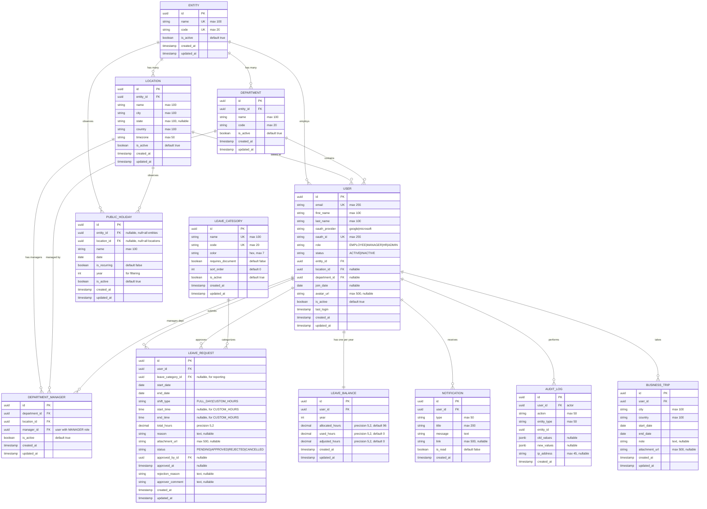

# Database Schema & ERD - Leave Management System

> **Updated:** 2026-01-16 | **Version:** 2.0
> **Key Change:** Hours-based unified balance (96h/year), Entity-Location hierarchy

## Entity Relationship Diagram (Mermaid v11)



---

## Schema Details

### 1. ENTITY
Top-level organizational unit (company, subsidiary, branch).

| Column | Type | Constraints | Description |
|--------|------|-------------|-------------|
| id | UUID | PK | Primary key |
| name | VARCHAR(100) | UNIQUE, NOT NULL | Entity name |
| code | VARCHAR(20) | UNIQUE, NOT NULL | Short code |
| is_active | BOOLEAN | DEFAULT true | Soft delete |
| created_at | TIMESTAMP | NOT NULL | Created |
| updated_at | TIMESTAMP | NOT NULL | Updated |

---

### 2. LOCATION
Physical locations under an entity.

| Column | Type | Constraints | Description |
|--------|------|-------------|-------------|
| id | UUID | PK | Primary key |
| entity_id | UUID | FK → entities, NOT NULL | Parent entity |
| name | VARCHAR(100) | NOT NULL | Location name |
| city | VARCHAR(100) | NOT NULL | City |
| state | VARCHAR(100) | NULL | State/Province |
| country | VARCHAR(100) | NOT NULL | Country |
| timezone | VARCHAR(50) | NOT NULL | IANA timezone |
| is_active | BOOLEAN | DEFAULT true | Soft delete |
| created_at | TIMESTAMP | NOT NULL | Created |
| updated_at | TIMESTAMP | NOT NULL | Updated |

**Constraint:** UNIQUE (entity_id, name)

---

### 3. DEPARTMENT
Departments within an entity.

| Column | Type | Constraints | Description |
|--------|------|-------------|-------------|
| id | UUID | PK | Primary key |
| entity_id | UUID | FK → entities, NOT NULL | Parent entity |
| name | VARCHAR(100) | NOT NULL | Department name |
| code | VARCHAR(20) | NOT NULL | Short code |
| is_active | BOOLEAN | DEFAULT true | Soft delete |
| created_at | TIMESTAMP | NOT NULL | Created |
| updated_at | TIMESTAMP | NOT NULL | Updated |

**Constraint:** UNIQUE (entity_id, code)

---

### 4. DEPARTMENT_MANAGER
Junction table linking managers to departments per location. Determines who can approve leave requests.

| Column | Type | Constraints | Description |
|--------|------|-------------|-------------|
| id | UUID | PK | Primary key |
| department_id | UUID | FK → departments, NOT NULL | Department |
| location_id | UUID | FK → locations, NOT NULL | Location |
| manager_id | UUID | FK → users, NOT NULL | Manager (role=MANAGER) |
| is_active | BOOLEAN | DEFAULT true | Soft delete |
| created_at | TIMESTAMP | NOT NULL | Created |
| updated_at | TIMESTAMP | NOT NULL | Updated |

**Constraint:** UNIQUE (department_id, location_id, manager_id)

**Approval Logic:**
```python
# Find valid approvers for an employee's leave request
def get_approvers(employee):
    return DepartmentManager.objects.filter(
        department_id=employee.department_id,
        location_id=employee.location_id,
        manager__entity_id=employee.entity_id,  # Same entity
        manager__role='MANAGER',
        is_active=True
    ).values_list('manager', flat=True)
```

---

### 5. USER (Custom Django User)
OAuth-only authentication with entity/location/department assignment.

| Column | Type | Constraints | Description |
|--------|------|-------------|-------------|
| id | UUID | PK | Primary key |
| email | VARCHAR(255) | UNIQUE, NOT NULL | Email (from OAuth) |
| first_name | VARCHAR(100) | NOT NULL | First name |
| last_name | VARCHAR(100) | NOT NULL | Last name |
| oauth_provider | VARCHAR(50) | NOT NULL | google, microsoft |
| oauth_id | VARCHAR(255) | UNIQUE, NOT NULL | OAuth user ID |
| role | VARCHAR(20) | NOT NULL | Role enum |
| status | VARCHAR(20) | NOT NULL, DEFAULT 'ACTIVE' | Status enum |
| entity_id | UUID | FK → entities, NOT NULL | Assigned entity |
| location_id | UUID | FK → locations, NULL | Work location |
| department_id | UUID | FK → departments, NULL | Department |
| join_date | DATE | NULL | Join date |
| avatar_url | VARCHAR(500) | NULL | Profile picture |
| is_active | BOOLEAN | DEFAULT true | Active flag |
| last_login | TIMESTAMP | NULL | Last login |
| created_at | TIMESTAMP | NOT NULL | Created |
| updated_at | TIMESTAMP | NOT NULL | Updated |

**Enums:**
```python
class UserRole(models.TextChoices):
    EMPLOYEE = 'EMPLOYEE', 'Employee'
    MANAGER = 'MANAGER', 'Manager'
    HR = 'HR', 'HR'
    ADMIN = 'ADMIN', 'Admin'

class UserStatus(models.TextChoices):
    ACTIVE = 'ACTIVE', 'Active'
    INACTIVE = 'INACTIVE', 'Inactive'
```

**Note:** Managers are linked to departments via `DEPARTMENT_MANAGER` table, not a direct FK.

---

### 6. LEAVE_CATEGORY
Categories for reporting/tracking (not separate balances).

| Column | Type | Constraints | Description |
|--------|------|-------------|-------------|
| id | UUID | PK | Primary key |
| name | VARCHAR(100) | UNIQUE, NOT NULL | Category name |
| code | VARCHAR(20) | UNIQUE, NOT NULL | Short code |
| color | VARCHAR(7) | NOT NULL | Hex color |
| requires_document | BOOLEAN | DEFAULT false | Needs attachment |
| sort_order | INTEGER | DEFAULT 0 | Display order |
| is_active | BOOLEAN | DEFAULT true | Soft delete |
| created_at | TIMESTAMP | NOT NULL | Created |
| updated_at | TIMESTAMP | NOT NULL | Updated |

**Note:** Categories are for reporting only. All leave draws from ONE unified balance pool.

---

### 7. LEAVE_REQUEST
Employee leave submissions (hours-based).

| Column | Type | Constraints | Description |
|--------|------|-------------|-------------|
| id | UUID | PK | Primary key |
| user_id | UUID | FK → users, NOT NULL | Requester |
| leave_category_id | UUID | FK → leave_categories, NULL | For reporting |
| start_date | DATE | NOT NULL | Start date |
| end_date | DATE | NOT NULL | End date |
| shift_type | VARCHAR(20) | NOT NULL | FULL_DAY or CUSTOM_HOURS |
| start_time | TIME | NULL | Start time (if CUSTOM_HOURS) |
| end_time | TIME | NULL | End time (if CUSTOM_HOURS) |
| total_hours | DECIMAL(5,2) | NOT NULL | Total leave hours |
| reason | TEXT | NULL | Reason |
| attachment_url | VARCHAR(500) | NULL | Document URL |
| status | VARCHAR(20) | NOT NULL, DEFAULT 'PENDING' | Status |
| approved_by_id | UUID | FK → users, NULL | Approver |
| approved_at | TIMESTAMP | NULL | Approval time |
| rejection_reason | TEXT | NULL | If rejected |
| approver_comment | TEXT | NULL | Approver note |
| created_at | TIMESTAMP | NOT NULL | Created |
| updated_at | TIMESTAMP | NOT NULL | Updated |

**Enums:**
```python
class ShiftType(models.TextChoices):
    FULL_DAY = 'FULL_DAY', 'Full Day'        # 8 hours
    CUSTOM_HOURS = 'CUSTOM_HOURS', 'Custom Hours'  # Flexible time range

class LeaveStatus(models.TextChoices):
    PENDING = 'PENDING', 'Pending'
    APPROVED = 'APPROVED', 'Approved'
    REJECTED = 'REJECTED', 'Rejected'
    CANCELLED = 'CANCELLED', 'Cancelled'
```

**Business Logic:**
```
IF start_date == end_date:
    IF shift_type == 'FULL_DAY':
        total_hours = 8
    ELSE:  # CUSTOM_HOURS
        total_hours = end_time - start_time (e.g., 14:00 - 09:00 = 5 hours)
ELSE:
    total_hours = working_days_between(start_date, end_date) × 8
```

**Indexes:**
- `idx_leave_request_user_status` on (user_id, status)
- `idx_leave_request_dates` on (start_date, end_date)

---

### 8. LEAVE_BALANCE
Unified hours-based balance per user per year.

| Column | Type | Constraints | Description |
|--------|------|-------------|-------------|
| id | UUID | PK | Primary key |
| user_id | UUID | FK → users, NOT NULL | Employee |
| year | INTEGER | NOT NULL | Balance year |
| allocated_hours | DECIMAL(5,2) | NOT NULL, DEFAULT 96.00 | Annual allocation |
| used_hours | DECIMAL(5,2) | DEFAULT 0.00 | Hours used |
| adjusted_hours | DECIMAL(5,2) | DEFAULT 0.00 | Manual adjustments |
| created_at | TIMESTAMP | NOT NULL | Created |
| updated_at | TIMESTAMP | NOT NULL | Updated |

**Constraint:** UNIQUE (user_id, year)

**Computed (application level):**
```
remaining_hours = allocated_hours + adjusted_hours - used_hours
remaining_days = remaining_hours / 8
```

**Notes:**
- Default: 96 hours/year (12 days × 8 hours)
- No carry-over: balance resets each year
- One balance per user per year (no per-type breakdown)

---

### 9. PUBLIC_HOLIDAY
Holidays scoped by entity/location.

| Column | Type | Constraints | Description |
|--------|------|-------------|-------------|
| id | UUID | PK | Primary key |
| entity_id | UUID | FK → entities, NULL | NULL = all entities |
| location_id | UUID | FK → locations, NULL | NULL = all locations |
| name | VARCHAR(100) | NOT NULL | Holiday name |
| date | DATE | NOT NULL | Holiday date |
| is_recurring | BOOLEAN | DEFAULT false | Yearly repeat |
| year | INTEGER | NOT NULL | For filtering |
| is_active | BOOLEAN | DEFAULT true | Soft delete |
| created_at | TIMESTAMP | NOT NULL | Created |
| updated_at | TIMESTAMP | NOT NULL | Updated |

**Constraint:** UNIQUE (entity_id, location_id, date)

---

### 10. NOTIFICATION
In-app notifications.

| Column | Type | Constraints | Description |
|--------|------|-------------|-------------|
| id | UUID | PK | Primary key |
| user_id | UUID | FK → users, NOT NULL | Recipient |
| type | VARCHAR(50) | NOT NULL | Notification type |
| title | VARCHAR(200) | NOT NULL | Title |
| message | TEXT | NOT NULL | Body |
| link | VARCHAR(500) | NULL | Click URL |
| is_read | BOOLEAN | DEFAULT false | Read flag |
| created_at | TIMESTAMP | NOT NULL | Created |

---

### 11. AUDIT_LOG
System-wide audit trail.

| Column | Type | Constraints | Description |
|--------|------|-------------|-------------|
| id | UUID | PK | Primary key |
| user_id | UUID | FK → users, NOT NULL | Actor |
| action | VARCHAR(50) | NOT NULL | Action type |
| entity_type | VARCHAR(50) | NOT NULL | Table name |
| entity_id | UUID | NOT NULL | Record ID |
| old_values | JSONB | NULL | Before state |
| new_values | JSONB | NULL | After state |
| ip_address | VARCHAR(45) | NULL | Client IP |
| created_at | TIMESTAMP | NOT NULL | Created |

---

## Seed Data

### Leave Categories (for reporting only)
```sql
INSERT INTO leave_categories (name, code, color, requires_document, sort_order) VALUES
('Annual Leave', 'AL', '#4CAF50', false, 1),
('Sick Leave', 'SL', '#F44336', true, 2),
('Personal Leave', 'PL', '#2196F3', false, 3),
('Family Emergency', 'FE', '#FF9800', false, 4),
('Other', 'OTH', '#9E9E9E', false, 99);
```

### Default Balance Setup
```sql
-- When creating a new user's balance for 2026:
INSERT INTO leave_balances (user_id, year, allocated_hours, used_hours, adjusted_hours)
VALUES ('user-uuid', 2026, 96.00, 0.00, 0.00);
```

---

### 11. BUSINESS_TRIP
Business trip records (separate from leave requests, no approval workflow).

| Column | Type | Constraints | Description |
|--------|------|-------------|-------------|
| id | UUID | PK | Primary key |
| user_id | UUID | FK → users, NOT NULL | Employee on trip |
| city | VARCHAR(100) | NOT NULL | Destination city |
| country | VARCHAR(100) | NOT NULL | Destination country |
| start_date | DATE | NOT NULL | Trip start |
| end_date | DATE | NOT NULL | Trip end |
| note | TEXT | NULL | Trip notes |
| attachment_url | VARCHAR(500) | NULL | Document URL |
| created_at | TIMESTAMP | NOT NULL | Created |
| updated_at | TIMESTAMP | NOT NULL | Updated |

**Indexes:**
- `idx_business_trips_user_start` on (user_id, start_date)
- `idx_business_trips_dates` on (start_date, end_date)

**Note:** Business trips are separate from leave requests and do NOT require approval or affect leave balance.

---

## Key Changes from v1

| Aspect | v1 | v2 |
|--------|----|----|
| Balance unit | Days | **Hours** |
| Balance structure | Per leave type | **Unified pool (96h)** |
| Half-day | Fixed AM/PM | **Flexible time range** |
| Carry-over | Supported | **Not supported** |
| Organization | Department only | **Entity → Location → Department** |
| Leave types | Separate balances | **Categories (reporting only)** |
| Manager assignment | User.manager_id (self-ref) | **DEPARTMENT_MANAGER junction table** |

---

## Django Model Structure

```
organizations/
├── models.py
│   ├── Entity
│   ├── Location
│   ├── Department
│   └── DepartmentManager  # Links managers to dept+location

users/
├── models.py
│   └── User (AbstractUser)

leaves/
├── models.py
│   ├── LeaveCategory
│   ├── LeaveRequest
│   ├── LeaveBalance
│   ├── PublicHoliday
│   └── BusinessTrip

core/
├── models.py
│   ├── Notification
│   └── AuditLog
```
